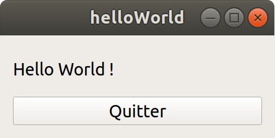

   

[](../../actions) [](../../actions)

# TP POO : Qt

- [TP POO : Qt](#tp-poo--qt)
  - [Qt](#qt)
    - [Présentation](#présentation)
    - [Framework](#framework)
    - [Architecture modulaire](#architecture-modulaire)
    - [Qt Creator](#qt-creator)
    - [Programmation événementielle](#programmation-événementielle)
    - [Projet Qt](#projet-qt)
    - [Widget et GUI](#widget-et-gui)
    - [Qt Designer](#qt-designer)
  - [Travail demandé](#travail-demandé)
  - [Annexes](#annexes)
    - [Liens](#liens)
    - [Installation](#installation)
    - [Tests unitaires](#tests-unitaires)
    - [Mise en oeuvre de Qt en ligne de commande (mode CLI)](#mise-en-oeuvre-de-qt-en-ligne-de-commande-mode-cli)

**Les objectifs de ce TP sont de s’initier à la programmation Qt.**

> Pour les enseignants, ceci est un "petit" devoir pour [Github Classroom](https://btssn-lasalle84.github.io/guides-developpement-logiciel/guide-classroom.html). Il montre l'utilisation des tests unitaires avec Qt, la notation automatique et l'insertion d'un badge pour l'affichage de la note.

## Qt

### Présentation

Qt est une bibliothèque logicielle orientée objet développée en C++. 

> Elle regroupe un ensemble de classes (préfixée par un `Q`). Elles héritent toutes de la classe mère `QObject` qui définit la notion d’un objet spécifique à Qt.

Qt assure la portabilité des applications (qui n'utilisent que ses composants) par simple recompilation du code source. Les environnements supportés sont les Unix (dont GNU/Linux), Windows et macOS.

### Framework

Qt peut être considéré comme un _framework_ car il fournit une bibliothèque logicielle ET une manière (un “cadre”) de les utiliser (notamment le mécanisme **signal/slot** propre à Qt).

> Un _framework_ est un ensemble de classes qui coopèrent et permettent des conceptions réutilisables. A ce titre, le _framework_ impose une certaine architecture à une application.

### Architecture modulaire

Un module Qt est un service logiciel (une “fonctionnalité” de la bibliothèque Qt) fourni sous la forme d’un ensemble de classes. Le module doit être “activé” dans la variable `QT` du fichier `.pro` d’un projet Qt pour pouvoir l’utiliser.

La bibliothèque logicielle Qt est donc modulaire. Généralement, le module Qt est fourni par une seule bibliothèque partagée (`.dll` ou `.so`) :

- `libQt5Core.so` pour le module `core`, `libQt5Gui.so` pour le module `gui` et `libQt5Widgets.so` pour le module `widgets` sous GNU/Linux
- `Qt5Core.dll` pour le module `core`, `Qt5Gui.dll` pour le module `gui` et `Qt5Widgets.dll` pour le module widgets © Windows

Qt offre notamment des composants (_widgets_) permettant de concevoir des interfaces graphiques (GUI). Depuis **Qt5**, les modules `core`, `gui` et `widgets` sont obligatoires.

Par exemple, le module `widgets` contient les classes `QWidget`, `QLabel`, `QPushButton`, `QComboBox`, ...

Les modules Qt sont nombreux (cela fait la richesse de cette API), on peut citer : `sql` (accès aux base de données), `network` (réseau), `charts` (graphiques), etc ...

> Qt fournit également un ensemble de classes décrivant des éléments non graphiques : accès aux données (fichier, base de données), connexions réseaux (_socket_), gestion du multitâche (_thread_), XML, etc.

### Qt Creator

Qt Creator est un environnement de développement intégré (EDI). Il a été créé avec le _framework_ Qt. Il est censé faciliter la conception de programmes Qt.

> :warning: Il ne faut pas confondre Qt et Qt Creator : Qt est une bibliothèque logicielle et Qt Creator est un environnement de développement intégré (EDI ou _IDE_). Et cela n’a strictement rien à voir !

Il est important de comprendre que Qt Creator n’est pas indispensable pour créer des programmes Qt. Un simple éditeur de texte (comme `vim`), un compilateur C++ (comme `g++`), un utilitaire (comme `make`) et bien évidemment les bibliothèques et ses outils comme `qmake` Qt suffisent pour fabriquer un programme Qt.

### Programmation événementielle

La programmation événementielle est une programmation basée sur les événements. Elle est utilisée principalement dans les environnements graphiques (GUI). C’est notamment le cas dans les systèmes d’exploitation avec un environnement graphique (comme © Windows par exemple).

La programmation événementielle est architecturée autour d’une boucle principale fournie et divisée en deux sections :

- la première section attend et détecte les événements,
- la seconde les gère.

Pour chaque événement (un _signal_ dans Qt) à gérer (un clic de souris, un appui sur une touche, ...), il faut lui associer une action à réaliser (le code d’une fonction ou méthode) : c’est le gestionnaire d'événement _handler_ (un _slot_ dans Qt).

Ensuite, à chaque fois que l'événement sera détecté par la boucle d'événements, le gestionnaire d'événement (_handler_) sera alors exécuté.

> Dans Qt, la boucle d’événement est réalisée par l’appel bloquant `exec()` d'un objet `QApplication` dans le fichier `main.cpp` du projet. Si on le remplace par un `return 0`, la fenêtre s’affiche (`show()`) mais se ferme immédiatement et le programme se termine !

Spécificités Qt :

- un _signal_ (un événement) se déclare comme une méthode (une fonction membre) d’une classe. Évidemment, un signal ne se définit pas. Un signal n’est donc pas réellement une méthode et n’a pas de “code” associé. Pour émettre “manuellement” un signal, on utilise `emit`.

- un _slot_ (gestionnaire d'événement) est une méthode (une fonction membre) d’une classe. Il représente le code qui sera exécuté lorsque le signal (auquel il est connecté) sera émis. Evidemment, un slot doit se définir (le coprs de la méthode).

Pour connecter (associer) un signal à un slot, on utilise l’appel `connect()` (et `disconnect()` pour le déconnecter).

Qt fournit “automatiquement” des signaux et des slots “prêts à l’emploi”. Il est bien évident que l’on peut créer ses propres signaux et ses propres slots.

### Projet Qt

Un projet Qt est défini par un fichier d’extension `.pro`. Ce fichier est très important car il décrit le contenu d’un projet Qt par l’intermédiaire de variables.

Au minimum, il contient :

```
# la liste des modules Qt utilisés
QT      += core gui widgets
# la liste des fichiers sources (de définitions)
SOURCES += main.cpp xxx.cpp
# la liste des fichiers d'en-têtes (de déclarations)
HEADERS += xxx.h
```

> Il existe d’autres variables permettant par exemple de lister des dépendances, des paramètres passés au compilateur, des ressources, etc.

Ce fichier `.pro` est utilisé par l’utilitaire `qmake` fourni par Qt.

> Qt Creator génère probablement un fichier `.pro.user` qui est spécifique à la configuration personnelle de l’utilisateur. Ce fichier n’a aucune “valeur” dans un développement collaboratif. Il est d’autre part spécifique à la version de Qt Creator utilisée et à la plateforme (© Windows, GNU/Linux, MacOs, ...).

`qmake` prend en entrée un fichier de projet Qt `.pro` et génère un fichier de règles (`Makefile` par exemple) permettant de fabriquer un exécutable spécifique à la plateforme (© Windows, GNU/Linux, MacOs, iOS, Android, …). `qmake` est aussi capable de générer initialement un fichier de projet Qt `.pro.`

### Widget et GUI

Avec Qt, les éléments (ou composants) graphiques prédéfinis sont appelés des _widgets_ (pour _windows gadgets_). Les _widgets_ sont les éléments principaux de la création d’interface graphique utilisateur (GUI) avec Qt.

Les _widgets_ peuvent afficher des données et des informations sur un état, recevoir des actions de l’utilisateur et agir comme un conteneur pour d’autres _widgets_ qui doivent être regroupés.

Les _widgets_ classiques sont les boutons (`QPushButton`) , les listes déroulantes (`QComboBox`) etc ...

Quelques caractéristiques de base des widgets :

- ils sont créés "cachés" (_hide_)
- ils sont capable de se "peindre" (_paint_) donc d’être “visible”
- ils sont capable de recevoir les événements souris, clavier
- ils sont tous rectangulaires
- ils sont initialisés par défaut en coordonnées 0,0
- ils sont ordonnés suivant l’axe z (la profondeur)
- ils peuvent avoir un _widget_ parent et des _widgets_ enfants

La classe `QWidget` fournit la capacité de base d’affichage à l’écran et de gestion des événements. elle est la classe mère de toutes les classes servant à réaliser des interfaces graphiques ou des _widgets_ personnalisés (en héritant de `QWidget` ou d'une de ses classes filles).

Pour concevoir une interface graphique Qt, il suffit de créer une fenêtre personnalisée en héritant de `QWidget`, `QDialog` ou `QMainWindow`. Ensuite, on compose sa fenêtre personnalisée en y intégrant des _widgets_ (`QPushButton`, `QComboBox`, ...).

> La classe Qt dédiée au fenêtre principale est bien évidemment `QMainWindow`. Cette classe Qt a sa propre structure "prête à l'emploi" à laquelle on peut ajouter une barre outils `QToolBars`, un menu `QMenuBar`, une barre d'état `QStatusBar` et des fenêtres _dockable_ `QDockWidgets`. Le tracé a une zone centrale qui peut être occupée par n'importe quel type de _widget_.

Qt fournit un système de disposition (nommé _layout_) pour l’organisation et le positionnement automatique des widgets. Ce gestionnaire de placement permet l’agencement facile et le bon usage de l’espace disponible. Un _layout_ est invisible.

Il permet un positionnement relatif et ainsi d'éviter un positionnement absolu (généralement très déconseillé car cela pose des problèmes de résolution d’écran, de redimensionnement, ...).

Les layouts sont spécialisés. Dans Qt, les plus utilisés sont :

- `QHBoxLayout` : placement automatique en horizontal
- `QVBoxLayout` : placement automatique en vertical
- `QGridLayout` : placement en grille

### Qt Designer

Qt Designer est un logiciel qui permet de créer des interfaces graphiques Qt dans un environnement convivial. L’utilisateur, par glisser-déposer, place les composants d’interface graphique et y règle leurs propriétés facilement.

Les fichiers d’interface graphique sont formatés en XML et portent l’extension `.ui`. Lors de la compilation, le fichier d’interface graphique `.ui` est converti en classe C++ par l’utilitaire `uic`, fourni par Qt.

> Qt Designer n’est évidemment pas indispensable pour produire des interfaces graphiques Qt.

## Travail demandé

L’objectif est de réaliser pas à pas une application GUI (_graphical user interface_) avec Qt.

- l’utilisation des _widgets_
- la mise en œuvre du mécanisme _signal/slot_

On souhaite réaliser une application qui permettra de faire des conversions entre unités de mesure utilisées en navigation maritime :


On se limitera aux conversions suivantes :

- Celcius → Farenheit
- Farenheit → Celcius

Le fonctionnement de l’application est assez simple :

- le bouton Convertir assure une conversion de la valeur saisie dans l’unité choisie
- le bouton Quitter permet de terminer l’application

Si la valeur saisie est vide, on affichera simplement “–.–” comme résultat. Si l’utilisateur change d’unité, cela reviendra à permuter le résultat avec la valeur saisie.

## Annexes

### Liens

- https://www.qt.io/ et https://doc.qt.io/
- http://tvaira.free.fr/dev/qt/
- http://tvaira.free.fr/dev/qt/faq-qt.html

### Installation

Pour une installation de base avec les paquets sous Ubuntu :

```sh
$ sudo apt install qt5-default qt5-doc qt5-qmake qt5-qmake-bin qtbase5-dev qtbase5-private-dev qtbase5-dev-tools qtbase5-doc qtbase5-doc-dev qtbase5-doc-html qtbase5-examples qtcreator
```

Il existe aussi `aqtinstall`, un utilitaire au programme d'installation de Qt, à utiliser dans un environnement CI où une interface utilisateur interactive n'est pas utilisable, ou simplement en ligne de commande.

Il peut télécharger automatiquement des fichiers binaires, des documents et des sources Qt prédéfinis pour la cible spécifiée, lorsque les versions se trouvent sur des sites miroirs de téléchargement Qt.

Liens : https://github.com/miurahr/aqtinstall/ et [Getting Started](https://aqtinstall.readthedocs.io/en/latest/getting_started.html)

Installation :

```sh
$ pip install -U pip
$ pip install aqtinstall

$ aqt list-qt linux desktop
5.9.0 5.9.1 5.9.2 5.9.3 5.9.4 5.9.5 5.9.6 5.9.7 5.9.8 5.9.9
5.10.0 5.10.1
5.11.0 5.11.1 5.11.2 5.11.3
5.12.0 5.12.1 5.12.2 5.12.3 5.12.4 5.12.5 5.12.6 5.12.7 5.12.8 5.12.9 5.12.10 5.12.11 5.12.12
5.13.0 5.13.1 5.13.2
5.14.0 5.14.1 5.14.2
5.15.0 5.15.1 5.15.2
6.0.0 6.0.1 6.0.2 6.0.3 6.0.4
6.1.0 6.1.1 6.1.2 6.1.3
6.2.0 6.2.1 6.2.2 6.2.3 6.2.4
6.3.0 6.3.1 6.3.2
6.4.0 6.4.1 6.4.2
6.5.0
```

### Tests unitaires

Lien : https://doc.qt.io/qt-6/qtest-tutorial.html

Lancement des tests unitaires :

```sh
$ cd tests
$ qmake
$ make
$ ./test-convertisseur.out
********* Start testing of TestConvertisseur *********
Config: Using QtTest library 5.12.8, Qt 5.12.8 (x86_64-little_endian-lp64 shared (dynamic) release build; by GCC 9.3.0)
PASS   : TestConvertisseur::initTestCase()
PASS   : TestConvertisseur::testConvertir(none)
PASS   : TestConvertisseur::testConvertir(int)
PASS   : TestConvertisseur::testConvertir(double)
PASS   : TestConvertisseur::cleanupTestCase()
Totals: 5 passed, 0 failed, 0 skipped, 0 blacklisted, 1ms
********* Finished testing of TestConvertisseur *********
```

> Il faut activer le module `testlib` dans le fichier de projet `.pro` : `QT += testlib`

### Mise en oeuvre de Qt en ligne de commande (mode CLI)

Étape n°1 : création du répertoire et du fichier `main.cpp`


Étape n°2 : création d’une classe Widget (avec un `QLabel` et un `QPushButton`)


Étape n°3 : création et fabrication du projet Qt


On obtient :



Étape n°4 (bonus) : voyage au coeur d’un exécutable


Étape n°5 : nettoyage du projet


> Une fois le projet Qt "nettoyé", on obtient les seuls fichiers à conserver pour ce projet Qt (par exemple pour un projet collaboratif avec `svn` ou `git`). Les autres fichiers (dont l’exécutable) sont des fichiers générés (ils n’ont AUCUNE VALEUR pour un développeur).

Les outils Qt :

- `qmake` : un programme qui gère le processus de création des projets de développement sur différentes plates-formes. Il automatise la génération des Makefiles pour n’importe quel projet logiciel, qu’il soit écrit avec Qt ou non.
- `moc` (_Meta Object Compiler_) : un programme qui gère les spécificités de Qt en générant des fichiers 100% C++.
- `uic` (_User Interface Compiler_) : un programme qui génére des classes C++ à partir de fichiers .ui en XML décrivant une interface graphique.


